# 🧜 My DueNorth Mermaid

> **Making Mermaid AWESOME** — A comprehensive showcase of [Mermaid](https://mermaid.js.org/) diagram types, from simple flowcharts to complex entity-relationship diagrams.

[](https://mermaid.js.org/)
[](#diagram-types)

---

## Table of Contents

- [Flowchart](#-flowchart)
- [Sequence Diagram](#-sequence-diagram)
- [Gantt Chart](#-gantt-chart)
- [Class Diagram](#-class-diagram)
- [State Diagram](#-state-diagram)
- [Entity Relationship Diagram](#-entity-relationship-diagram)
- [User Journey](#-user-journey)
- [Pie Chart](#-pie-chart)
- [Quadrant Chart](#-quadrant-chart)
- [Timeline](#-timeline)
- [Mindmap](#-mindmap)

---

## 🔷 Flowchart

A flowchart showing a typical software development workflow:

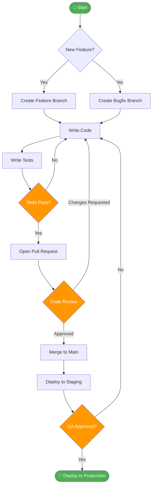

---

## 🔁 Sequence Diagram

A sequence diagram illustrating a user authentication flow:

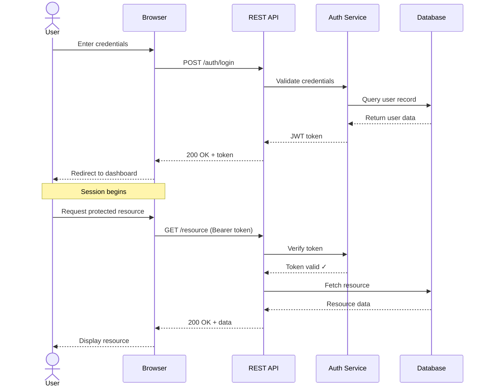

---

## 📅 Gantt Chart

A project timeline for building a web application:

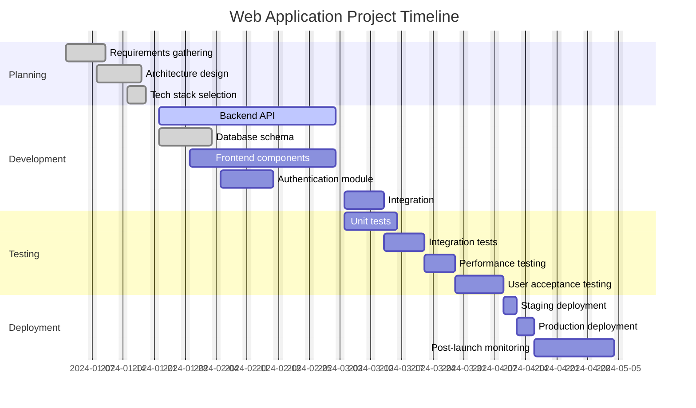

---

## 🏛️ Class Diagram

A class diagram for an e-commerce domain model:

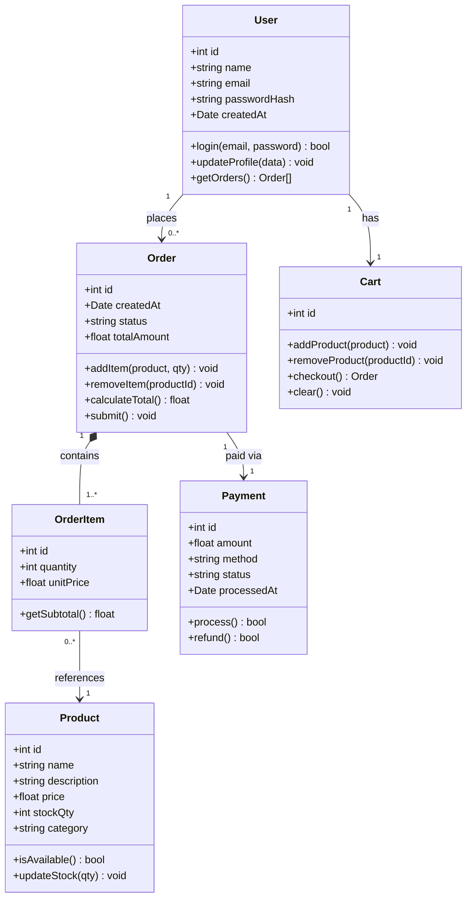

---

## 🔄 State Diagram

A state diagram for an order lifecycle:

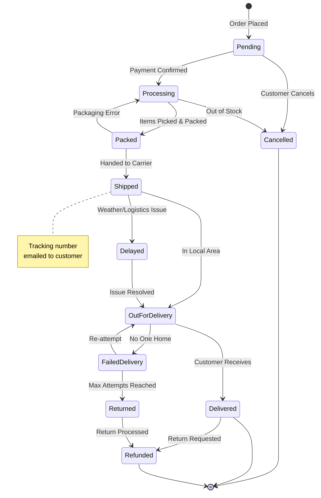

---

## 🗄️ Entity Relationship Diagram

An ER diagram for a blog platform database:

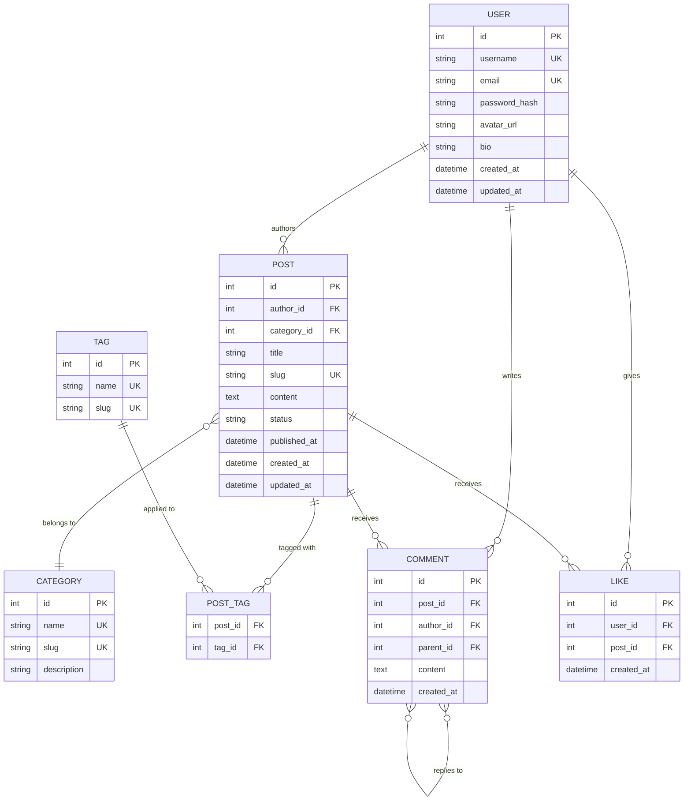

---

## 🧭 User Journey

A user journey map for onboarding a new customer:

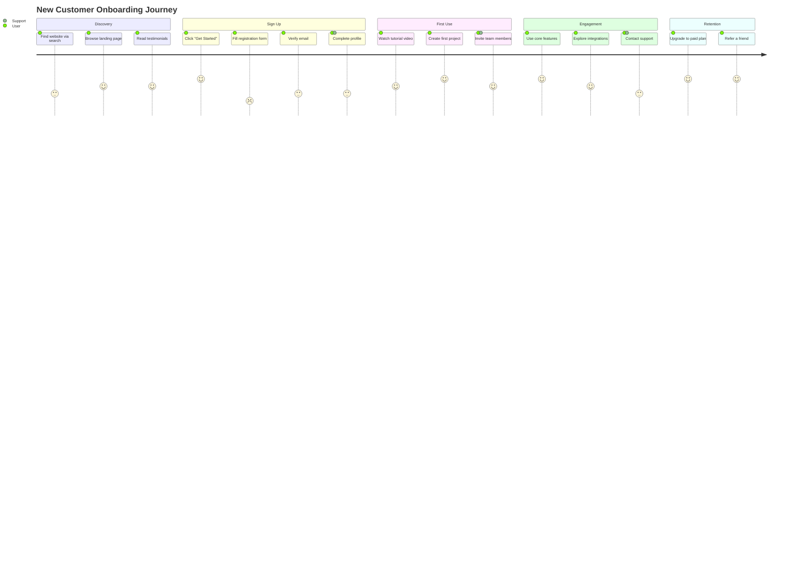

---

## 🥧 Pie Chart

Distribution of programming languages used in the project:

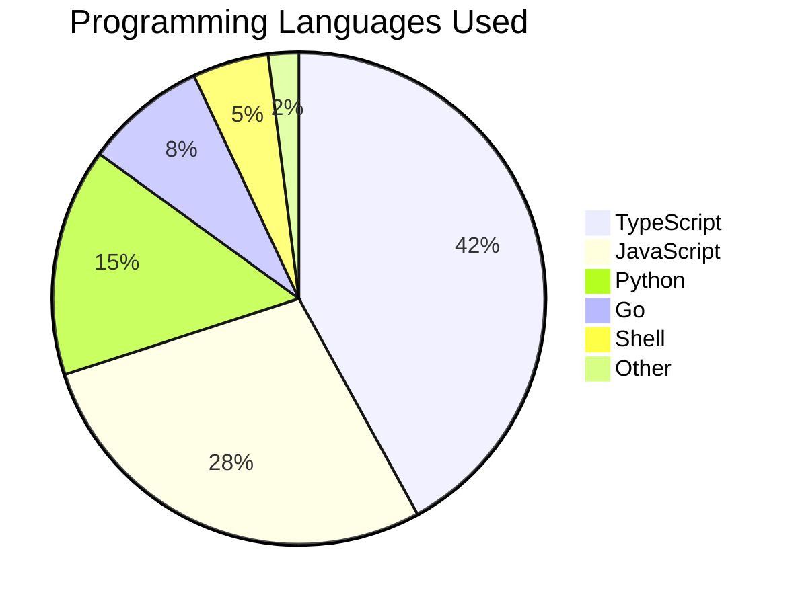

---

## 📊 Quadrant Chart

Feature prioritization matrix:

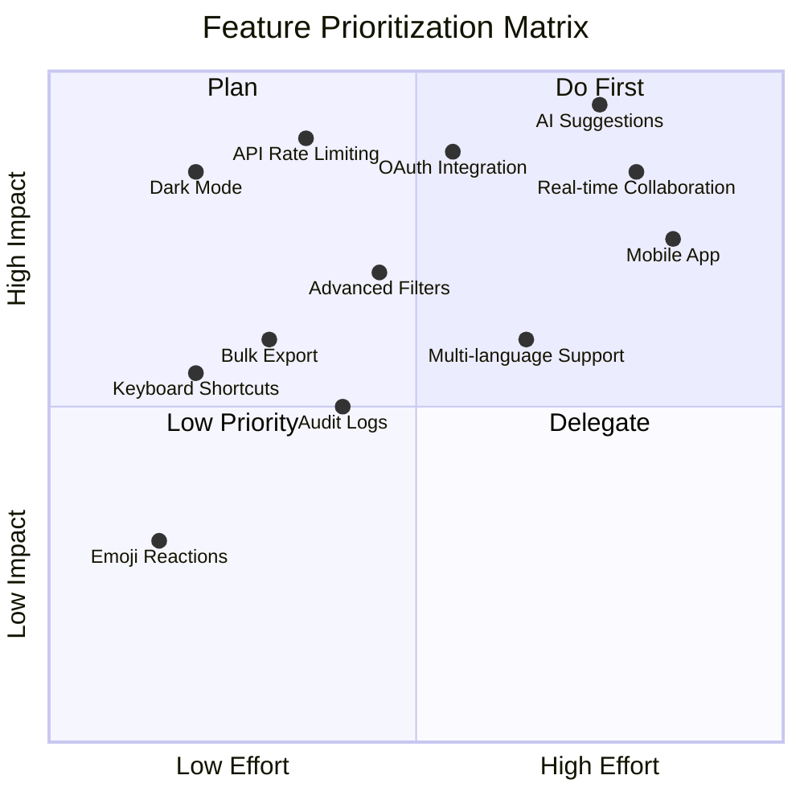

---

## 📆 Timeline

Key milestones in Mermaid's history:

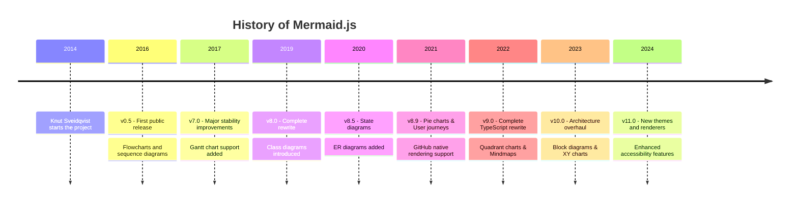

---

## 🧠 Mindmap

A mindmap showing the ecosystem around Mermaid.js:

```mermaid
mindmap
  root((Mermaid.js))
    Diagram Types
      Flowchart
      Sequence
      Gantt
      Class
      State
      ER
      Journey
      Pie
      Quadrant
      Timeline
      Mindmap
    Integrations
      GitHub
        Native rendering
        Actions workflows
      VS Code
        Extensions
        Preview
      Confluence
      Notion
      Obsidian
    Rendering
      Browser
        CDN
        npm package
      CLI
        mmdc
        SVG output
        PNG output
      Server-side
    Themes
      Default
      Forest
      Dark
      Neutral
      Base
```

---

## 🚀 Getting Started with Mermaid

### In GitHub Markdown

Simply wrap your diagram in a fenced code block with `mermaid` as the language:

````markdown
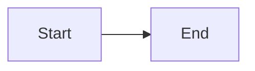
````

### With the Mermaid CLI

```bash
# Run without installing (recommended)
npx @mermaid-js/mermaid-cli mmdc -i diagram.mmd -o diagram.svg

# Or install globally
npm install -g @mermaid-js/mermaid-cli@11.4.1

# Render a diagram
mmdc -i diagram.mmd -o diagram.svg
```

### In a Web Page

```html
<!DOCTYPE html>
<html>
  <body>
    <pre class="mermaid">
      flowchart LR
          A[Start] --> B[End]
    </pre>
    <script type="module">
      // Pin to a specific version to prevent supply chain attacks
      import mermaid from 'https://cdn.jsdelivr.net/npm/mermaid@11.4.1/dist/mermaid.esm.min.mjs';
      mermaid.initialize({ startOnLoad: true, theme: 'default' });
    </script>
  </body>
</html>
```

---

## 📚 Resources

| Resource | Link |
|----------|------|
| 📖 Official Docs | [mermaid.js.org](https://mermaid.js.org/) |
| 🎮 Live Editor | [mermaid.live](https://mermaid.live/) |
| 💬 Community | [GitHub Discussions](https://github.com/mermaid-js/mermaid/discussions) |
| 🐛 Issues | [GitHub Issues](https://github.com/mermaid-js/mermaid/issues) |
| 📦 npm Package | [npmjs.com/package/mermaid](https://www.npmjs.com/package/mermaid) |

---

<div align="center">
  Made with ❤️ and <strong>Mermaid</strong> 🧜
</div>
